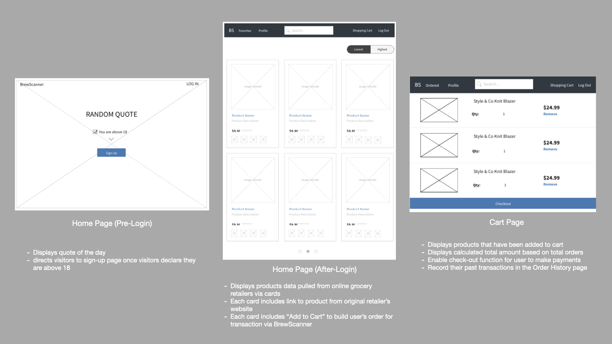

# SEI-23 Project 4

## BrewScanner

Stocking up for beer-o'clock at home? Find the cheapest beer deals for out there with:
[BrewScanner](https://brewscanner.herokuapp.com/)!

<!-- ### Motivation -->

### User Stories
<pre>As a <b>[bar-goer who prefer to stay home during Covid-19 pandemic]</b>, 
I'd like to <b>[stock up on beer]</b>
so that <b>[I could still hold happy hours with some friends at home]</b></pre>

<pre>As a <b>[person that shops online]</b>, 
I'd want to <b>[view listings of cheapest deals and product varieties without 
having to visit the supplying online stores / online supermarkets separately]</b> 
so I can <b>[compare product prices within the same site]</b></pre>

<pre>As a <b>[person that shops online]</b>, 
I'd like to <b>[order and purchase products from different suppliers (eg. FairPrice & Cold Storage) 
under a single transaction]</b>
so <b>[I do not need to go to each supplier's online store to make my purchase]</b></pre>

### Site Usage
- As a visitor that is 18 years old or above, you are eligible to register for an account and sign in to view product listing
- As a registered user, you can search and filter products, sort according to product prices to facilitate your shopping experience
- As a registered user, you can add products to your cart and check out your cart.
- As a registered user, you can view your past transactions under Order History. 

### Technologies
1. Node.js
2. Express.js
3. React, React-Router-Dom
4. MongoDB, mongoose
5. Bcrypt
6. JSON Web Token
7. Axios
8. Cheerio
9. Bootstrap, React-Bootstrap
10. Heroku

### Models
1. User
2. Transaction

### Wireframe 

<!-- ### ERD -->
<!--  -->

### Product
#### Landing Page (Before Login)

#### Home Page (After Login)

### MVP 
#### Features
- Allow sign up for visitor who declares that they are 18 or above
- List products from supplying online stores (eg. Cold Storage / FairPrice)
- Show product's name, unit, price and a hyperlink that directs to the detailed product information on the original supplier's website
- Allow searches via search box input, filter by suppliers
- Allow sorting of products based on prices
- Allow user to update user's address

### Further
#### Features
- Adding products to cart
- Storing user's last cart activity (pre-check out) into Local Storage so that the next time he/she visits BrewScanner on the same device, his/her cart information is intact.
- Allow user to remove individual item, item's quantity count or remove all items from cart
- Allow user to check out/purchase cart items. Clear existing information from cart upon purchase.
- Display user's past transactions on Order History page

<!-- 
#### Bugs & Issues Faced

1. Calculated ratings were always 1-step-behind during display. 
    - Resolved: adding {new: true} in findByIdAndUpdate()
        - From Mongoose Doc: "[options.new=false] «Boolean» By default, findByIdAndUpdate() returns the document as it was before update was applied. If you set new: true, findOneAndUpdate() will instead give you the object after update was applied."

#### Further Possible Improvements
- Refactor code
- Dynamic addition of new rows to fill in additional brew types & their prices
- Geolocation (Bars near me), show on googlemap with bar pins (name & HH price) 
- Filter listing based on HH start time
- Ratings & Comments
    - Restrict user from rating the same bar more than once
    - Allow users to leave comments with timestamp

- Button options to sorting bars based on Normal price, happy hour price, happy hour time in a location 
- A list of top 10 bars based on ratings & no of reviews 
- A list of top 10 bars with additional filters (eg. price or time or locaton)

#### Sources
- Logo and favicon by [flaticon](https://www.flaticon.com/)

#### Grateful for
- [Guru Schnecke](https://github.com/guru-schnecke) -->

